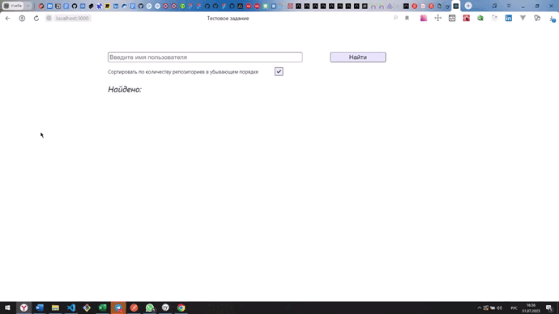

# Тестовое задание на вакансию Junior Web-разработчик 

~~~~~~~~~~

~~~~~~~~~~

### Стэк:
* React
* React-Router
* React_Context
* React Modal
* REST API
* Cypress

### Задание:
Необходимо реализовать интерфейс поиска пользователей.
Данные по пользователям берем с https://api.github.com/search/users?q={имя пользователя} (документация https://developer.github.com/v3/search/#search-users)

### Требования:
* Поиск: по логину.
* Сортировка: по кол-ву репозиториев (возрастанию/убыванию)
* Использовать React.
* Пагинация.
* При клике на элемент - открываются подробности (как и какие на усмотрение разработчика).
* Реализовать 3 юнит-теста на функционал. 

### Ссылки:
* :mag_right: [Открыть проект](https://gutmalina.github.io/search-users-github/)

